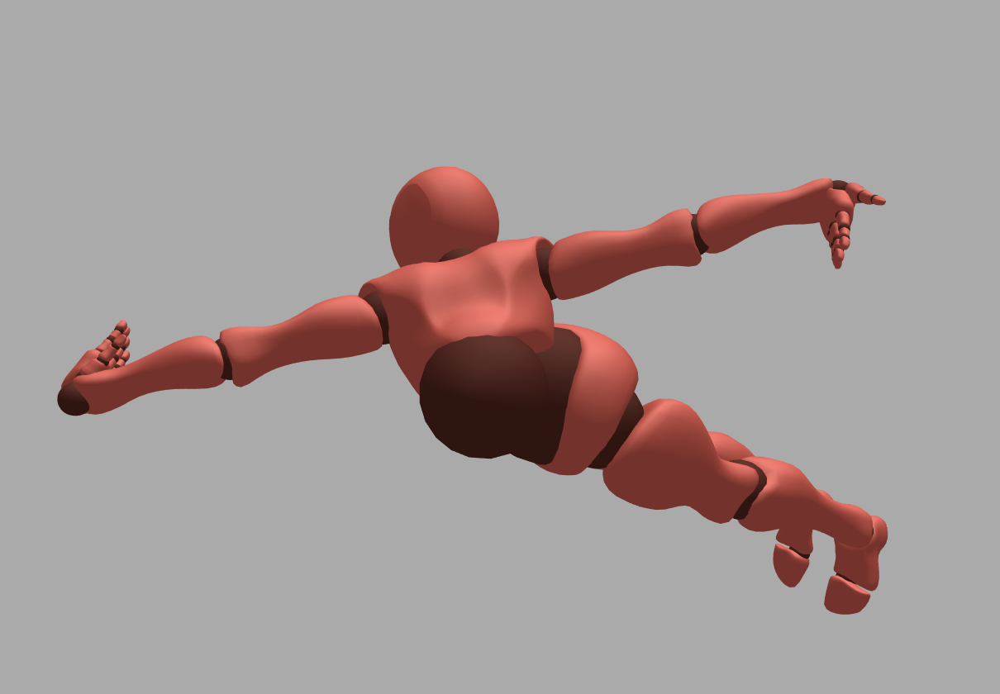

# [WIP/Not working] 
# WebIK - An inverse kinematics for WebVR with support for 3️⃣ThreeJs and 🅰️A-Frame.

WIP of an inverse kinematics for WebVR to create full body avatars. 

The code still needs to be fully debugged and does not working correcty yet. 

## Want to make some changes to it?

Please do! Together we can bring full body avatars to the web!

### Installation

First make sure you have Node installed.

On Mac OS X, it's recommended to use [Homebrew](http://brew.sh/) to install Node + [npm](https://www.npmjs.com):

    brew install node

To install the Node dependencies:

    npm install

### Local Development

To serve the site from a simple Node development server:

    npm start

Then launch the site from your favourite browser:

[__http://localhost:3333/__](http://localhost:3333/)

## License

Distributed under an [MIT License](LICENSE).
